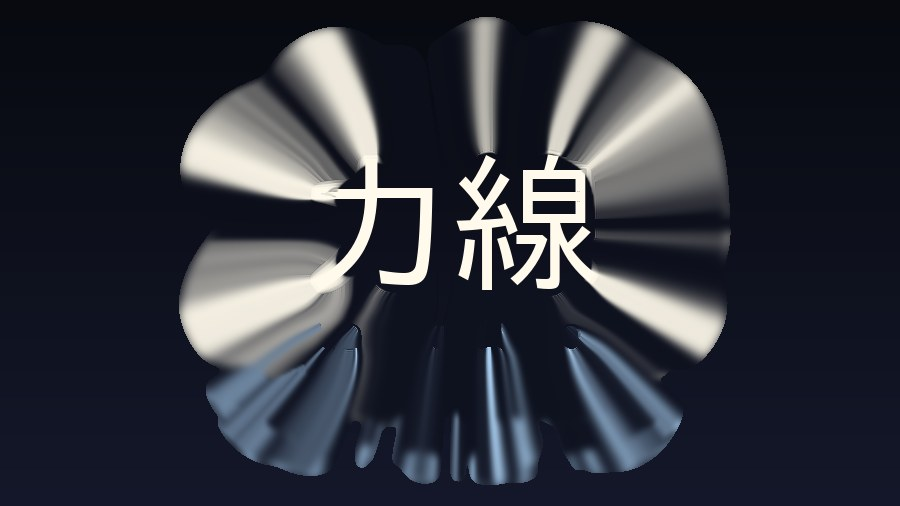
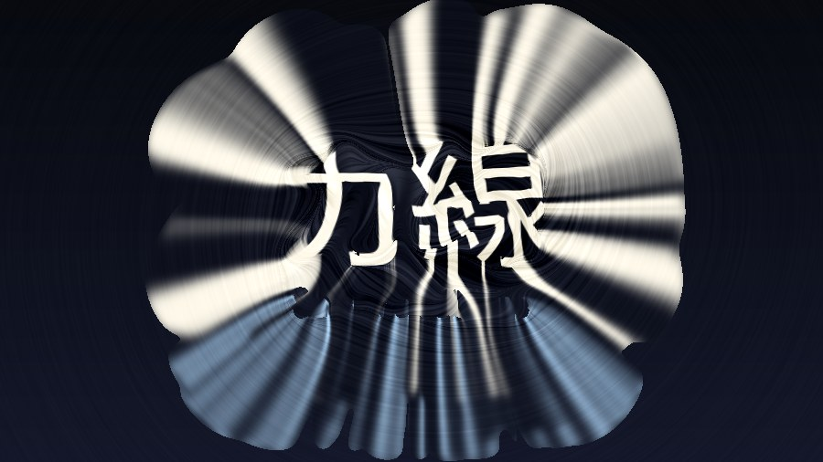

# Sa_FieldLine


画像の**輪郭そのものを「力場の発生源」として扱う**エフェクト。

エッジから法線を取り出し、それを周囲へ広げてベクトル場を作る。
場は重ね合わせで互いに干渉し、進行方向が少しずつ曲がる。
できた流線に沿って画素・色を動かすと、輪郭から磁力線／電気力線のような流れが生まれる。

> ノイズで歪ませるのではなく、**変形方向が元画像の輪郭から決まる**のがこのエフェクトの本質。

このリポジトリには 3 つの実装が入っている。

| | 場所 | 用途 |
| --- | --- | --- |
| **YMM4 プラグイン** | ルート（C# / HLSL） | 本番。Direct2D カスタムエフェクトを 15 本つないだパス構成 |
| リファレンス実装 | `prototype/fieldline.py` | 挙動の基準。percentile 正規化など GPU では使えない演算を含む |
| GPU 相当シミュレーション | `prototype/gpu_sim.py` | **HLSL はこのファイルを 1:1 で移植したもの。** 数式を変えるときはまずここを直す |

Windows も YMM4 も無しで検証できるものを 2 つ用意してある。

```bash
python3 tests/gpu_pipeline_regression.py   # リファレンスと GPU 相当の差
python3 tests/edge_cases.py                # 端の条件で NaN が出ないか
sh tests/hlsl_syntax_check.sh              # HLSL の構文（glslang + D2D ヘルパのスタブ）
```

設計の詳細は [docs/YMM4_IMPLEMENTATION.md](docs/YMM4_IMPLEMENTATION.md)。

---

## 処理の流れ

| # | 段階 | 内容 |
| --- | --- | --- |
| 1 | エッジ検出 | 複数スケールのガウス微分。σ 正規化（Lindeberg γ=1）で粗いエッジが不当に弱くならないようにする |
| 2 | 法線 | 合成勾配を正規化して法線 n を得る。強度はロバスト正規化＋ソフト閾値で信頼度 `conf` に |
| 3 | 場の生成 | `conf · n` をオクターブ違いのガウスで重ね、≈1/r の長距離カーネルで周囲へ拡散 |
| 4 | 干渉 | 符号付きの重ね合わせなので、向かい合うエッジの法線は打ち消し合い零線（分水嶺）ができる。さらに場の curl で進行方向を継続的に曲げる |
| 5 | 流線 | 各画素から場を後退積分。歩幅は px 基準で一定（ジャギー防止）。終点へのベクトルが変位 |
| 5b | 伝播 | 引き伸ばしは流線を追わず、輪郭の色を 1 歩ずつ隣へ伝播させる。色・輪郭の強さ・伝播距離を一緒に運ぶ |

### 「ぐにゃぐにゃ変形」にしないための要点

- 曲げの源はノイズではなく **場の curl**（＝エッジ同士の干渉）
- エッジは**複数スケール**で取り、`Detail Scale` で細/粗を配合する
- 細かすぎるエッジは `Edge Threshold` のソフト閾値で抑える
- ベクトル場の平滑化は**近傍のディテールを壊さない程度**に留める
  （強く掛けると即座に単なるレンズ歪みになる）
- **引き伸ばしは平均ではなく「1つ選んで保持」で作る**
  - 流線上のサンプルを平均すると、必ず方向ボケにしかならない
  - 優先度の argmax を取ると、色が帯のまま伸びて縁が立つ
- **ただし、1画素ずつ長い流線を追ってはいけない**
  - 滑らかな場でも、鞍点の近くで隣接画素の流線は指数的に離れる
  - 隣同士が別の輪郭に着くので、出力は櫛状の破線になる
  - これは画素のエイリアスではなく実構造なので、解像度を上げても消えない
  - **1歩ずつ隣へ伝播させる**（各反復で 1 歩上流だけを見て、より強い輪郭から
    来た色を受け継ぐ）と、隣接画素は必ず近い結果になり縞が出ない
- **端の色を引き出すなら、場は輪郭から外向きでなければならない**
  - 接線方向（Swirl 1.0）だと流線が輪郭と平行に走り、輪郭に到達しないので色を拾えない
  - `stretch_radial` で φ の勾配から専用の放射場を作る。勾配場なので回転成分を持たず、素直に放射する
  - 放射場では流線をさかのぼれば必ず輪郭に着くので、前後両方向の走査は要らない（コスト半分）
- **合成せず完全不透明で上書きする**
  - 半透明で混ぜると下の絵が透けて濁る
  - 塗る／塗らないの二値にし、範囲は優先度と `flow_length` で決める
- **「流線がどこまで伸びるか」と「効果をどれだけ適用するか」を分ける**
  - 伸び：場のコヒーレンスだけでゲート（零線で暴れないように）
  - 適用量：エッジからの距離減衰 φ でゲート（輪郭から離れると元画像が残る）

### 「集中線」にしないための要点

引き伸ばしは放って置くと漫画の集中線になる。原因は 2 つあって、どちらも構造的なもの。

- **外向きの引き伸ばしは、被写体より遠くでは必ず放射の束になる**
  - 遠方では φ（輪郭密度）が単極子に潰れるので、その勾配はどこでも「重心から外向き」になる
  - **場の作り方の問題ではない。** φ を近距離のカーネルに替えても、
    最寄りの輪郭からの距離場（＝本来いちばん素直な押し出し）に替えても、実測ではむしろ悪化した
  - 効くのは「遠方へ行かせないこと」だけ。`近さを優先` を上げると
    弱い輪郭ほど手前で止まり、塗った範囲が被写体の形に沿う
  - `引き伸ばしのひねり` を少し入れると消失点が消えて、束ではなく渦になる
- **塗った範囲の縁が真円になる**
  - `近さを優先` が 0 だとどの流線も `flow_length` いっぱいまで届くので、縁が距離の等高線＝円盤になる
  - `筆の毛` は優先度をばらつかせる。届く距離は優先度で決まるので、毛先が不揃いになって円弧が消える

### 一番外側の輪郭が外側を独占しないようにする

`conf` はソフト閾値なので、膝を超えた輪郭はすべて 1.0 に飽和する。優先度をこれだけで作ると
**どの輪郭も同点**になり、同点は距離ペナルティで決まるので、外側の輪郭が必ず勝つ。

> 内側の輪郭を画面で一番強い輪郭（外周の 2.3 倍）にしたテスト画像でも、
> 内側の色は 1px も外へ出なかった。輪郭のすぐ手前まで来て 0.006 差で負ける。

そこで優先度に輪郭の**強さ**を残す。ただし画素ごとの強さのまま競わせると、
隣り合う画素が別の輪郭に当たって櫛状の縞が戻るので、輪郭の帯の幅で
`conf` を重みにした平均を取り、「この輪郭の強さ」にしてから使う。
強さは絶対値ではなく**画面平均との比**で持つので、正規化の係数は約分されて消える。

### 法線の符号は幾何ではなく明暗で決まる

法線は常に明るい側を向く。明るい被写体の外周では内向き、暗い被写体では外向きになり、
向かい合った法線は長距離拡散で打ち消し合う（文字では輪郭の強さの 84〜94% が消える）。

これは**符号の付け方の間違いではなく、細い線の遠方場が双極子になるという幾何**で、
`-∇φ` と符号を揃えてから足す実装も試したが、線の両側は揃えても逆向きのままなので効かず、
太い輪郭では内側と外側が打ち消し合って**かえって場が弱くなった**（60px の線で 0.12 倍）。
細い線の素材で場を立てたいときは、打ち消し合わない `引力/反発`（φ の勾配）を混ぜる。

### 場そのものを見る

`fl.field_lines()` はベクトル場を LIC で可視化する。下は上の文字から生まれた場。


輪郭から線が湧き出し、輪郭同士が向かい合う所に零線（分水嶺）ができているのが分かる。

---

## サンプル

以下はすべて **プラグインと同じ演算だけで組んだパイプライン**（`gpu_sim.py`）の出力。

| | |
| --- | --- |
|  元画像 |  磁力線（回転 100% ＋ 力線） |
|  電気力線（反発 ＋ 力線） |  変位＋色収差 |
|  文字の色を引き伸ばす |  引き伸ばし＋力線（場を分ける） |

文字に掛けるときは `強さ` を小さく（10% 前後）して、
字そのものは残したまま周囲に力線を出すのが扱いやすい。
引き伸ばしは `強さ 0` でも成立する（変位を使わず、輪郭の色だけを外へ運ぶ）。

> 文字のように**輪郭がまばらな素材**は、写真とは統計が違う。ここで 2 つ踏んだ。
>
> - 正規化を「写真で測った絶対値」にしていると効果が丸ごと沈む。
>   `K_MAG` / `K_PHI` / `K_COH` はすべて**比**（percentile ÷ 全画面 RMS）で持つ。
> - 色を**固定距離**で拾うと、輪郭の太い帯の外縁が背景色を運ぶ種になって帯が眠くなる。
>   φ（輪郭密度）の尾根まで登って拾う。すでに尾根にいる画素は自分の色のままになるので、
>   文字の面が背景色で塗り潰されない。

---

## パラメータ

### 主なもの

| 名前 | 変数 | 内容 |
| --- | --- | --- |
| Strength | `strength` | 変位の強さ |
| Radius | `radius` | エッジの影響範囲 [px]。場の広がりと距離減衰の両方を決める |
| Curvature | `curvature` | 流れの曲がり具合（curl による継続的な旋回） |
| Swirl | `swirl` | 回転成分。1.0 で法線を 90° 回し、流れが輪郭に巻き付く（磁力線） |
| Attract / Repel | `attract` | +で輪郭へ引き寄せ、−で輪郭から放射（電気力線） |
| Flow Length | `flow_length` | 流線の長さ [px] |
| Edge Threshold | `edge_threshold` | 使用するエッジの強さ |
| Smoothness | `smoothness` | ベクトル場の滑らかさ |
| Detail Scale | `detail_scale` | 0 で大きい輪郭のみ、1 で細かい輪郭のみ |
| Preserve Original | `preserve_original` | 元画像を残す量 |

### 発展（流線に沿った加工）

| 名前 | 変数 | 内容 |
| --- | --- | --- |
| **端の色を引き伸ばす** | `stretch` | 輪郭の色を流線に沿って外へ引き出し、**完全不透明**で上書きする。掴めなかった画素だけ元のまま |
| ├ 放射場 | `stretch_radial` | 引き伸ばし専用に「輪郭から外向き」の場を使う。変位側が Swirl でも引き伸ばしは放射のまま |
| ├ 届く距離 | `flow_length` | 届く距離の**上限**。実際にどこまで届くかは輪郭の強さと `stretch_decay` で決まる |
| ├ 拾う輪郭 | `stretch_gate` | これ未満しか掴めなかった画素は元のまま |
| ├ 拾う位置 | `stretch_pick` | 輪郭から少し内側 [px]。線画の黒ではなく面の色を引き出す |
| ├ ひねり | `stretch_swirl` | 0 で真っ直ぐ外向き |
| ├ 何を拾うか | `stretch_mode` | `edge`（輪郭 / この用途の既定）・`contrast`・`bright`・`dark`・`vivid`・`far` |
| ├ ストロークの太さ | `stretch_scale` | 優先度マップのぼかし [px] |
| ├ 近さを優先 | `stretch_decay` | 0 だとどの流線も `flow_length` いっぱいまで届き、塗った範囲が円盤になる（＝集中線）。上げると弱い輪郭ほど手前で止まる。既定 0.6 |
| ├ 筆の毛 | `stretch_jitter` | 優先度をばらつかせて毛先を不揃いにする。`stretch_decay` が 0 だとほぼ効かない |
| 色を平均する | `smear` | 流線方向の異方性ボケ。柔らかい用途向け |
| 階調を丸める | `posterize` | 色をフラットに整理する（0で無効） |
| 力線を描く | `line_draw` | ノイズの LIC で力線そのものを描画。`line_grain` / `line_density` で太さと濃さ |
| エッジ色の流出 | `streamer` | 上流のエッジの色を集めて引き出す。`streamer_split` で砂鉄のように線を分離 |
| 発光 | `glow` | 明部を流線に沿って伸ばしスクリーン合成 |
| 明度差 | `shade` | 流線方向の場の変化で陰影を付ける |
| 色収差 | `chroma` | RGB で流線長を変え、流れの方向に色をずらす |

### 品質

| 変数 | 内容 |
| --- | --- |
| `step_px` | 1 ステップの移動量 [px]。既定 1.25。**流線が長いときはここが画質を決める**。逆に 5〜8 まで粗くすると、階段状に飛ぶデータモッシュ風の意匠になる。引き伸ばしの伝播側は 1.5px 固定（2px を超えると櫛状の縞が戻ることを実測） |
| `steps` | ステップ数の上限 |
| `octaves` | エッジのスケール段数 |

---

## YMM4 プラグイン

### インストール

Release の `Sa_FieldLine.ymme` を YMM4 にドラッグ＆ドロップする。
エフェクトは **フィルタ → Sa_FieldLine**。

### ビルド

Windows SDK の `fxc.exe` と YMM4 本体の DLL が要る。

```powershell
dotnet build .\SaFieldLine.csproj -c Release `
  "-p:YMM4DirPath=C:/path/to/YukkuriMovieMaker/" `
  "-p:FxcPath=C:/Program Files (x86)/Windows Kits/10/bin/10.0.22621.0/x64/fxc.exe" `
  "-p:D2DIncludePath=C:/Program Files (x86)/Windows Kits/10/Include/10.0.22621.0/um"
```

`.github/workflows/release.yml` が同じ手順を CI で回し、`.ymme` を Release に添付する。

### 検査

Windows も YMM4 も無い環境で回せる検査が 7 つある。`.github/workflows/check.yml` が
push ごとに全部回す。

```bash
sudo apt-get install -y glslang-tools dotnet-sdk-10.0
python3 tests/shader_inputs_check.py # 入力の本数が csproj / シェーダ / C# で一致しているか
python3 tests/params_wired_check.py  # UI のパラメータが Processor まで繋がっているか
sh tests/hlsl_syntax_check.sh       # 15 本の HLSL の構文
sh tests/csharp_compile_check.sh    # C# の型検査（YMM4 はスタブ / Vortice は本物）
python3 tests/preset_smoke.py       # サンプルのプリセットが今のパラメータ定義で通るか
python3 tests/edge_cases.py         # 端の条件で NaN が出ないか
python3 tests/gpu_pipeline_regression.py   # 参照実装とのずれ
```

C# の型検査は `tests/ymm4stub` の空実装を YMM4 の DLL に見立てて本体をビルドする。
Vortice だけは nuget の本物を使うので、組み込みエフェクトの名前・列挙・
`SetValue` の型はここで実際に検査される（詳しくは `tests/ymm4stub/README.md`）。

### UI パラメータ

| 名前 | 既定 | 内容 |
| --- | --- | --- |
| 強さ | 60% | 流線に沿って画素をどれだけ動かすか |
| 影響範囲 | 150px | 輪郭の力が届く範囲。場の広がりと距離減衰の両方 |
| 流線の長さ | 140px | 画素を運ぶ距離。引き伸ばしが届く距離の**上限**でもある |
| 曲がり | 100% | curl でどれだけ曲げるか |
| 回転 | 0% | 100% で流れが輪郭に巻き付く（磁力線） |
| 引力/反発 | 0% | +で輪郭へ、−で輪郭から放射（電気力線） |
| エッジ閾値 | 10% | これより弱い輪郭は使わない |
| 滑らかさ | 40% | 場を均す量。動画では 50% 前後が安全 |
| 輪郭の細かさ | 50% | 0% で大きい輪郭だけ、100% で細かい輪郭だけ |
| 引き伸ばし | 0% | 輪郭の色を外向きに引き伸ばす。届いた画素は**完全不透明**で塗り替わる |
| 引き伸ばし閾値 | 35% | これ未満しか輪郭を掴めなかった画素は元のまま |
| 引き伸ばしの太さ | 0px | ストローク幅（優先度マップのぼかし） |
| 色を拾う位置 | 4px | 輪郭より内側の色を引き出す。φ の尾根まで登って拾うので、これは探す距離の**下限** |
| 引き伸ばしのひねり | 0% | 0% で真っ直ぐ外向き。少し入れると集中線ではなく渦になる |
| 近さを優先 | 60% | 0% だと全部の流線が「流線の長さ」いっぱいまで届き、塗った範囲が円盤＝集中線になる |
| 筆の毛 | 0% | 流線ごとに届く距離をばらつかせ、毛先を不揃いにする |
| 力線を描く | 0% | 場そのものを線として重ねる（砂鉄） |
| 力線の粒 / 濃さ | 1.4px / 100% | 線の太さとコントラスト |
| 発光 | 0% | 明部が流線に沿って伸びて光る |
| 明度差 | 0% | 流線に沿った陰影 |
| 色収差 | 0% | RGB で流線長を変える |
| 元画像を残す | 0% | 最後に元の映像を混ぜ戻す |
| ステップ数 | 192 | 流線と伝播の最大パス数。引き伸ばしは「流線の長さ ÷ 1.5px」だけ要る。足りないと櫛状の縞が出る |

プロトタイプの `stretch_mode` / `smear` / `posterize` / `streamer` は
UI には出していない（用途が限定的なため）。

### 負荷

長距離拡散は縮小した解像度でやるので、**影響範囲を上げてもほとんど重くならない**。
効くのは流線の長さとステップ数で、順に重いのは

1. **力線を描く** — 前後 2 方向の LIC。等倍で最大 220 ステップ走る
2. **引き伸ばし** — 等倍で「流線の長さ ÷ 1.5px」パス
3. **発光** — 前後 2 方向。流線の長さの 2.2 倍を走る
4. 変位 — 等倍だが 1 ステップにつきテクスチャ 1 回読むだけ

重いときは **ステップ数**を下げる。ほぼ線形に軽くなるが、
引き伸ばしは 1 歩が 2px を超えたあたりから櫛状の縞が出はじめる。

---

## プロトタイプの使い方

```bash
pip install -r prototype/requirements.txt
python3 prototype/render_gallery.py <input.jpg> <outdir>
```

単体で使う場合:

```python
import fieldline as fl
out, fieldset = fl.render(img_float_rgb, fl.Params(strength=0.8, radius=150,
                                                   flow_length=140, swirl=1.0,
                                                   line_draw=0.4))
```

`fieldset` にはベクトル場・エッジ・距離減衰が入っているので、
`fl.field_lines(fieldset, shape, params)` で場そのものを LIC 可視化できる。

---

## ライセンス

MIT
