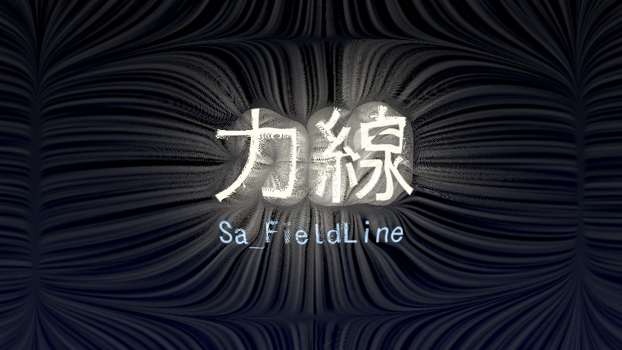
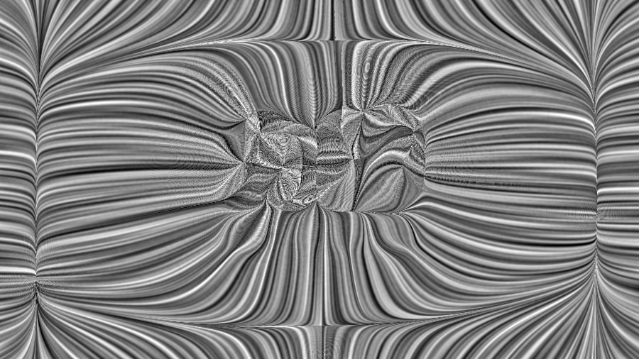
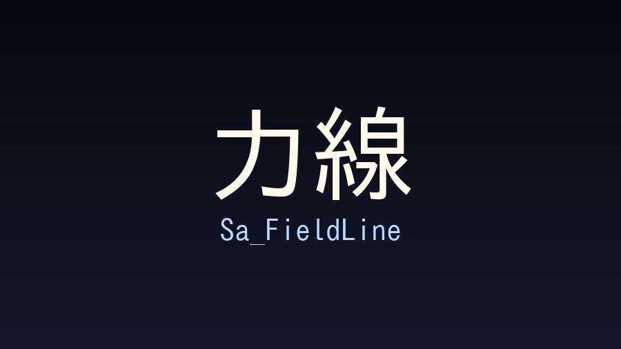
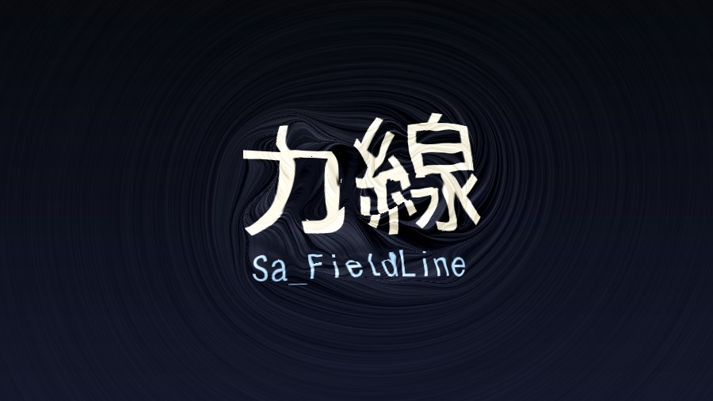
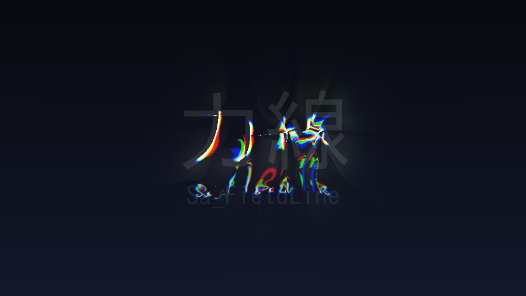

# Sa_FieldLine



画像の**輪郭そのものを「力場の発生源」として扱う**エフェクト。

エッジから法線を取り出し、それを周囲へ広げてベクトル場を作る。
場は重ね合わせで互いに干渉し、進行方向が少しずつ曲がる。
できた流線に沿って画素・色を動かすと、輪郭から磁力線／電気力線のような流れが生まれる。

> ノイズで歪ませるのではなく、**変形方向が元画像の輪郭から決まる**のがこのエフェクトの本質。

現在このリポジトリには **Python のリファレンス実装（プロトタイプ）** が入っている。
YMM4 プラグイン本実装は、ここで確定した挙動を移植する形で行う。

---

## 処理の流れ

| # | 段階 | 内容 |
| --- | --- | --- |
| 1 | エッジ検出 | 複数スケールのガウス微分。σ 正規化（Lindeberg γ=1）で粗いエッジが不当に弱くならないようにする |
| 2 | 法線 | 合成勾配を正規化して法線 n を得る。強度はロバスト正規化＋ソフト閾値で信頼度 `conf` に |
| 3 | 場の生成 | `conf · n` をオクターブ違いのガウスで重ね、≈1/r の長距離カーネルで周囲へ拡散 |
| 4 | 干渉 | 符号付きの重ね合わせなので、向かい合うエッジの法線は打ち消し合い零線（分水嶺）ができる。さらに場の curl で進行方向を継続的に曲げる |
| 5 | 流線 | 各画素から場を後退積分。歩幅は px 基準で一定（ジャギー防止）。終点へのベクトルが変位 |
| 5b | 伝播 | 引き伸ばしは流線を追わず、輪郭の色を 1 歩ずつ隣へ伝播させる。色・輪郭の強さ・伝播距離を一緒に運ぶ |

### 「ぐにゃぐにゃ変形」にしないための要点

- 曲げの源はノイズではなく **場の curl**（＝エッジ同士の干渉）
- エッジは**複数スケール**で取り、`Detail Scale` で細/粗を配合する
- 細かすぎるエッジは `Edge Threshold` のソフト閾値で抑える
- ベクトル場の平滑化は**近傍のディテールを壊さない程度**に留める
  （強く掛けると即座に単なるレンズ歪みになる）
- **引き伸ばしは平均ではなく「1つ選んで保持」で作る**
  - 流線上のサンプルを平均すると、必ず方向ボケにしかならない
  - 優先度の argmax を取ると、色が帯のまま伸びて縁が立つ
- **ただし、1画素ずつ長い流線を追ってはいけない**
  - 滑らかな場でも、鞍点の近くで隣接画素の流線は指数的に離れる
  - 隣同士が別の輪郭に着くので、出力は櫛状の破線になる
  - これは画素のエイリアスではなく実構造なので、解像度を上げても消えない
  - **1歩ずつ隣へ伝播させる**（各反復で 1 歩上流だけを見て、より強い輪郭から
    来た色を受け継ぐ）と、隣接画素は必ず近い結果になり縞が出ない
- **端の色を引き出すなら、場は輪郭から外向きでなければならない**
  - 接線方向（Swirl 1.0）だと流線が輪郭と平行に走り、輪郭に到達しないので色を拾えない
  - `stretch_radial` で φ の勾配から専用の放射場を作る。勾配場なので回転成分を持たず、素直に放射する
  - 放射場では流線をさかのぼれば必ず輪郭に着くので、前後両方向の走査は要らない（コスト半分）
- **合成せず完全不透明で上書きする**
  - 半透明で混ぜると下の絵が透けて濁る
  - 塗る／塗らないの二値にし、範囲は `flow_length` だけで決める
- **「流線がどこまで伸びるか」と「効果をどれだけ適用するか」を分ける**
  - 伸び：場のコヒーレンスだけでゲート（零線で暴れないように）
  - 適用量：エッジからの距離減衰 φ でゲート（輪郭から離れると元画像が残る）

### 場そのものを見る

`fl.field_lines()` はベクトル場を LIC で可視化する。下は上の文字から生まれた場。



輪郭から線が湧き出し、輪郭同士が向かい合う所に零線（分水嶺）ができているのが分かる。

---

## サンプル

| | |
| --- | --- |
|  元画像 |  磁力線（Swirl 1.0） |
|  電気力線（Repel） |  変位＋色収差 |

文字に掛けるときは `Strength` を小さく（0.1 前後）して、
字そのものは残したまま周囲に力線を出すのが扱いやすい。

---

## パラメータ

### 主なもの

| 名前 | 変数 | 内容 |
| --- | --- | --- |
| Strength | `strength` | 変位の強さ |
| Radius | `radius` | エッジの影響範囲 [px]。場の広がりと距離減衰の両方を決める |
| Curvature | `curvature` | 流れの曲がり具合（curl による継続的な旋回） |
| Swirl | `swirl` | 回転成分。1.0 で法線を 90° 回し、流れが輪郭に巻き付く（磁力線） |
| Attract / Repel | `attract` | +で輪郭へ引き寄せ、−で輪郭から放射（電気力線） |
| Flow Length | `flow_length` | 流線の長さ [px] |
| Edge Threshold | `edge_threshold` | 使用するエッジの強さ |
| Smoothness | `smoothness` | ベクトル場の滑らかさ |
| Detail Scale | `detail_scale` | 0 で大きい輪郭のみ、1 で細かい輪郭のみ |
| Preserve Original | `preserve_original` | 元画像を残す量 |

### 発展（流線に沿った加工）

| 名前 | 変数 | 内容 |
| --- | --- | --- |
| **端の色を引き伸ばす** | `stretch` | 輪郭の色を流線に沿って外へ引き出し、**完全不透明**で上書きする。掴めなかった画素だけ元のまま |
| ├ 放射場 | `stretch_radial` | 引き伸ばし専用に「輪郭から外向き」の場を使う。変位側が Swirl でも引き伸ばしは放射のまま |
| ├ 届く距離 | `flow_length` | **塗る範囲はこれで決まる**（減衰を掛けないため） |
| ├ 拾う輪郭 | `stretch_gate` | これ未満しか掴めなかった画素は元のまま |
| ├ 拾う位置 | `stretch_pick` | 輪郭から少し内側 [px]。線画の黒ではなく面の色を引き出す |
| ├ ひねり | `stretch_swirl` | 0 で真っ直ぐ外向き |
| ├ 何を拾うか | `stretch_mode` | `edge`（輪郭 / この用途の既定）・`contrast`・`bright`・`dark`・`vivid`・`far` |
| ├ ストロークの太さ | `stretch_scale` | 優先度マップのぼかし [px] |
| ├ 面ごと引きずる量 | `stretch_drag` | **0 のまま使う。** >0 にすると平坦な面まで丸ごと動き、「端の色」ではなく「画像そのもの」を引き伸ばす挙動になる |
| ├ 近さの優先 | `stretch_decay` | 0 なら流線上で最も強い輪郭の色が届く |
| ├ 筆の毛 | `stretch_jitter` / `_scale` | 流線ごとに長さをばらつかせる |
| 色を平均する | `smear` | 流線方向の異方性ボケ。柔らかい用途向け |
| 階調を丸める | `posterize` | 色をフラットに整理する（0で無効） |
| 力線を描く | `line_draw` | ノイズの LIC で力線そのものを描画。`line_grain` / `line_density` で太さと濃さ |
| エッジ色の流出 | `streamer` | 上流のエッジの色を集めて引き出す。`streamer_split` で砂鉄のように線を分離 |
| 発光 | `glow` | 明部を流線に沿って伸ばしスクリーン合成 |
| 明度差 | `shade` | 流線方向の場の変化で陰影を付ける |
| 色収差 | `chroma` | RGB で流線長を変え、流れの方向に色をずらす |

### 品質

| 変数 | 内容 |
| --- | --- |
| `step_px` | 1 ステップの移動量 [px]。既定 1.25。**流線が長いときはここが画質を決める**。逆に 5〜8 まで粗くすると、階段状に飛ぶデータモッシュ風の意匠になる |
| `steps` | ステップ数の上限 |
| `octaves` | エッジのスケール段数 |

---

## プロトタイプの使い方

```bash
pip install -r prototype/requirements.txt
python3 prototype/render_gallery.py <input.jpg> <outdir>
```

単体で使う場合:

```python
import fieldline as fl
out, fieldset = fl.render(img_float_rgb, fl.Params(strength=0.8, radius=150,
                                                   flow_length=140, swirl=1.0,
                                                   line_draw=0.4))
```

`fieldset` にはベクトル場・エッジ・距離減衰が入っているので、
`fl.field_lines(fieldset, shape, params)` で場そのものを LIC 可視化できる。

---

## ライセンス

MIT
